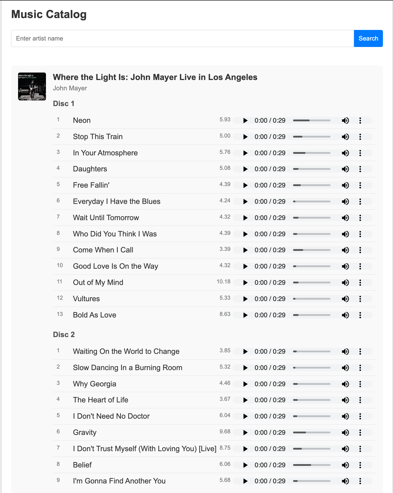
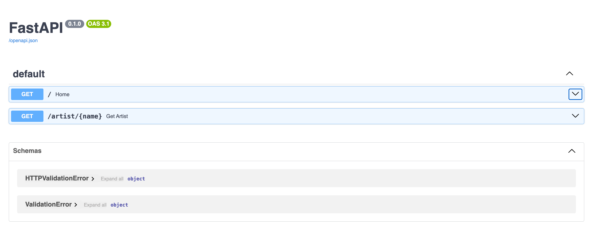

# Python Introductory Course: Final Project Base Repository

Welcome to the base repository for the final project of the Python Introductory Course! This repository serves as the foundation for your final project, where you'll apply the knowledge you've gained throughout the course to contribute to and improve an open-source project on GitHub.

## Project Overview

In this course, you've learned the fundamentals of Python programming, including working with data structures, functions, modules, and object-oriented programming. The final project is designed to help you gain experience working with real-world open-source projects on GitHub. You'll start by forking this repository, making improvements or adding new features, and ultimately submitting your work back to the community.

### Key Objectives

- **Understand and Navigate a GitHub Repository**: Learn how to navigate and understand the structure of an open-source project.
- **Forking and Cloning**: Practice forking a repository, cloning it to your local environment, and setting up a Python project.
- **Feature Development**: Add a new feature, improve existing functionality, or fix bugs in the codebase.
- **Version Control**: Use Git for version control to manage and track your changes.
- **Collaboration**: Learn how to collaborate with others by submitting pull requests and reviewing code.

## Prerequisites

Before you can begin working on this project, you need to set up your development environment by installing the necessary tools. Below are step-by-step instructions for both macOS and Windows to install:

 1. Visual Studio Code (VSCode)
 2. Python
 3. Git

### For macOS (using Homebrew)

1. Open a terminal (search for “Terminal” in Spotlight or find it in the Applications > Utilities folder).
2. Ensure Homebrew is installed by running:

```bash
brew --version
```

If Homebrew is not installed, install it with:

```bash
/bin/bash -c "$(curl -fsSL <https://raw.githubusercontent.com/Homebrew/install/HEAD/install.sh>)"
```

#### Install Visual Studio Code (Mac)

```bash
brew install --cask visual-studio-code
# verify installation
code --version
```

#### Install Python (Mac)

Open a terminal and check if Python 3 is already installed by running:

```bash  
python3 --version
```

If Python 3 is installed, you’ll see a version number like Python 3.x.x. If not, install Python using Homebrew:

```bash
brew install python
# verify installation
python3 --version
```

#### Install Git (Mac)

Open a terminal and check if Git is installed by running:

```bash
git --version
```

If Git is not installed, Homebrew will prompt you to install it, or you can manually install Git by running:

```bash
brew install git
# verify installation
git --version
```

### For Windows

#### Install Visual Studio Code (Windows)

1. Go to the VSCode website.
2. Click the Download for Windows button.
3. Open the .exe installer and follow the instructions:
 • Ensure the option to Add to PATH is checked.
4. Once installed, launch VSCode from the Start menu or by searching for it.

#### Install Python (Windows)

1. Go to the Python website.
2. Click the Download Python 3.x.x button.
3. Run the installer and make sure to check the box that says Add Python to PATH before clicking Install.
4. After installation, open Command Prompt (search “cmd” in the Start menu) and verify Python is installed:

```bash
python --version
```

You should see Python 3.x.x.

#### Install Git (Windows)

1. Go to the Git website.
2. Click Download for Windows.
3. Run the installer with the default settings. Ensure the option Use Git from the command line is selected.
4. After installation, open Command Prompt and verify the installation:

```bash
git --version
```

You should see the Git version number printed.

Once these steps are completed, you will have all the tools (VSCode, Python, Git) installed, and you’ll be ready to start working on the project!

## Getting Started

### 1. Fork the Repository

Start by forking this repository to your GitHub account. This will create a copy of the repository under your GitHub profile, where you can make your own changes.

### 2. Clone the Repository

Clone the forked repository to your local machine using the following command:

```bash
git clone https://github.com/your-username/intro-to-python.git
```

Navigate into the project directory:

```bash
cd intro-to-python
```

### 3. Set Up the Environment

Create a virtual environment and install the necessary dependencies:

```bash
# Create a virtual environment:
# ----------------------------
# On macOS, you use python3... 
# ... or create aliases in your profile (e.g., alias python=python3)
# I use short aliases for brevity, such as:
# alias py=python3
# alias g=git
python -m venv venv

# Activate the virtual environment:
# --------------------------------
# On Windows, use `venv\Scripts\activate`
source venv/bin/activate  

# Install the dependencies:
# ------------------------
# You can use pip3 instead
pip install -r requirements.txt
```

### 4. Running the Application with Uvicorn

After setting up the environment, you can run the application locally using [Uvicorn](https://www.uvicorn.org/), an ASGI server that is great for serving Python web applications, particularly those built with FastAPI or similar frameworks.

#### Step-by-Step Guide

1. **Ensure Uvicorn is Installed**:
   - Uvicorn should be listed in your `requirements.txt` file, so it should already be installed if you've run `pip install -r requirements.txt`.
   - If Uvicorn is not installed, you can install it manually:

   ```bash
   pip install uvicorn
   ```

2. **Run the Application**:
   - Use the following command to start the application:

   ```bash
   uvicorn api.main:app --reload
   ```

   Here’s a breakdown of the command:
   - `api.main:app` refers to the `app` object inside your `main.py` file located in the `api` directory. This is the application instance that Uvicorn will serve.
   - `--reload` enables auto-reloading, which is useful during development. It automatically restarts the server whenever you make changes to the code.

3. **Access the Application**:
   - Once Uvicorn is running, you can access the application by navigating to `http://127.0.0.1:8000` in your web browser.

4. **Stopping the Server**:
   - To stop the server, press `Ctrl + C` in your terminal.

#### Example Output

When you run the command, you should see output similar to this in your terminal:

```plaintext
INFO:     Uvicorn running on http://127.0.0.1:8000 (Press CTRL+C to quit)
INFO:     Started reloader process [12345] using StatReload
INFO:     Started server process [12346]
INFO:     Waiting for application startup.
INFO:     Application startup complete.
```

Navitage to <http://127.0.0.1:8000> in your browser to see the application in action, it should look like this after you enter the artist name:



Navigate to <http://127.0.0.1:8000/docs> to see the API documentation:



Now, you can interact with your Python web application directly from your browser or API client!

### 5. Explore the Project

Take some time to explore the project structure and understand the existing code. Familiarize yourself with the different modules and files in the repository.

### 6. Develop Your Feature or Improvement

Choose an area of the project to work on. You might want to add a new feature, improve an existing one, or fix a bug. Once you've identified what you want to work on, create a new branch for your changes:

```bash
git checkout -b feature/your-feature-name
```

### 7. Commit and Push Your Changes

As you work on your feature, commit your changes regularly:

```bash
git add .
git commit -m "Describe your changes here"
git push origin feature/your-feature-name
```

### 8. Submit a Pull Request

Once you're satisfied with your work, open a pull request to merge your changes back into your forked repository. If you'd like, you can also submit a pull request to the original repository to contribute your improvements to the wider community.

## Project Structure

Here's a brief overview of the project structure:

```plaintext
intro-to-python/
│
├── api/                  # API module
│   ├── __init__.py       # Initialization file for the package
│   └── main.py           # Main entry point for the API
│
├── model/                # Model module
│   ├── __init__.py       # Initialization file for the package
│   ├── album.py          # Album class
│   ├── artist.py         # Artist class
│   └── track.py          # Track class
│
├── service/              # Service module
│   ├── __init__.py       # Initialization file for the package
│   ├── filecache.py      # File cache implementation
│   └── itunes.py         # iTunes implementation
│
├── templates/            # HTML templates
│   └── index.html        # Home page
│
├── test/                 # Unit tests for the project
│   ├── test_album.py     # Tests for album
│   └── test_services.py  # Tests for services
│
├── requirements.txt      # List of project dependencies
├── README.md             # Project documentation (this file)
├── .gitignore            # .gitignore file
└── LICENSE               # License for the project
```

## Resources and Support

If you need help, feel free to reach out to your instructors or refer to the following resources:

- [GitHub Documentation](https://docs.github.com/)
- [Python Official Documentation](https://docs.python.org/3/)
- [Git Handbook](https://guides.github.com/introduction/git-handbook/)

## Contributing

We encourage you to contribute to this project by submitting pull requests with your improvements. Please ensure that your code follows the project's coding standards and includes appropriate tests.

## License

This project is licensed under the MIT License - see the [LICENSE](LICENSE) file for details.

---

### Good luck with your final project, and happy coding! 🎉
